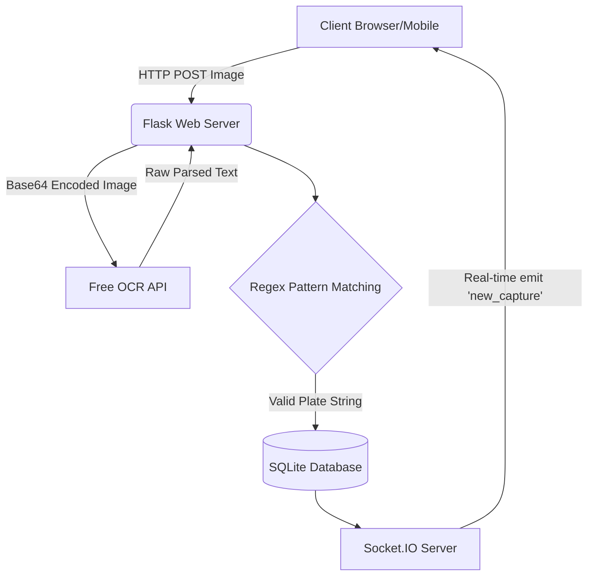

# An Intelligent License Plate Recognition System for Algerian Vehicles: Architecture and Implementation

**Abstract**—This paper presents the design and implementation of a License Plate Recognition (LPR) or Lecture Automatique de Plaques d'Immatriculation (LAPI) web application specifically tailored for Algerian license plates. The system utilizes Optical Character Recognition (OCR) combined with custom pattern matching algorithms to accurately extract and parse vehicle information including the wilaya (province), registration year, and vehicle type. Furthermore, the application features real-time data broadcasting and advanced filtering and sorting capabilities.

**Index Terms**—License Plate Recognition, OCR, Pattern Matching, WebSockets, Algerian License Plates.

## I. Introduction
The automated recognition of license plates is a critical component in modern intelligent transportation systems. In the context of Algeria, license plates follow a specific format that encodes the vehicle's registration number, type, year of registration, and the province (Wilaya) of origin. This report details the architecture and implementation of a responsive, real-time web application designed to capture, recognize, parse, and organize Algerian license plates using a combination of cloud-based OCR and robust local pattern matching.

## II. System Architecture
The application is built utilizing a modern client-server architecture designed for high responsiveness and real-time updates.

*   **Backend:** Developed in Python using the Flask framework. It handles image upload parsing, communicates with external OCR APIs, and stores historical data using SQLite. Socket.IO is integrated for asynchronous, real-time communication with connected clients.
*   **Frontend:** Built with vanilla JavaScript, modern CSS (incorporating glassmorphism and dark mode aesthetics), and HTML5. The frontend handles real-time DOM updates without requiring page reloads.



## III. Optical Character Recognition (OCR) Implementation
To extract text from captured images, the system integrates the Free OCR API (`api.ocr.space`). The image is encoded into a Base64 string and sent via a standard `urllib` POST request to the OCR engine.

### A. Fallback Mechanisms and Regex Data Cleaning
Given that OCR results from real-world camera captures often contain noise or misread characters, a resilient, multi-tiered parsing algorithm is implemented on the backend:
1. **Sanitization:** All non-alphanumeric characters (except spaces and hyphens) are stripped using regular expressions (`re.sub`).
2. **Primary Pattern Match:** The system searches for the exact Algerian standard pattern: `(\d{4,6})[\s\-]+(\d{3})[\s\-]+(\d{2})`. If matched, it constructs the formatted plate string.
3. **Secondary Fallback Match:** If the primary match fails, the system blindly extracts all digits. It then rebuilds the plate parts from right to left (since the Wilaya code and vehicle type represent the right-most digits), ensuring that even partial captures yield structured data.
4. **Mock Data Generation:** During API timeouts, the system generates synthesized mock data matching the Algerian format to maintain UI operability.

```mermaid
flowchart TD
    A[Raw OCR Text from API] --> B[Remove Special Chars]
    B --> C{Matches (\d{4,6})-(\d{3})-(\d{2})?}
    C -->|Yes| D[Extract Matricule, Middle, Wilaya]
    C -->|No| E[Extract Digits Only]
    E --> F{Total Digits >= 9?}
    F -->|Yes| G[Rebuild Parts Right-to-Left]
    F -->|No| H[Return Raw Text]
    D --> I((Final Plate String))
    G --> I
```

## IV. Wilaya Matching and Metadata Parsing
Once the plate string reaches the frontend, advanced JavaScript logic (`parseAlgerianPlate()`) breaks the recognized string into contextual demographic and automotive data.

### A. Wilaya Identification
The last segment of the plate (typically 2 digits) represents the Wilaya code. The application uses a hardcoded dictionary mapping codes (e.g., `"16"` to `"Alger"`, `"31"` to `"Oran"`) covering all 58 Wilayas. If a code greater than 58 is detected, it is classified as a "Nouvelle Wilaya."

### B. Vehicle Type and Registration Year
The middle segment (exactly 3 digits) is parsed into two distinct datapoints:
- **Vehicle Type:** The first digit dictates the type via a lookup table (e.g., `"1": "Véhicule Tourisme"`, `"2": "Camion"`, `"9": "Moto"`).
- **Registration Year:** The next two digits determine the year. A pivot logic is applied: if the value is greater than 50 (e.g., 99), the year is resolved as `19xx` (1999); otherwise, it is resolved as `20xx` (e.g., 22 becomes 2022).

## V. Advanced Sorting and Grouping
To handle a large influx of real-time captures natively on the client device without overwhelming the database, dynamic filtering and grouping mechanisms are implemented in `script.js`.

- **Search Filtering:** An `input` event listener triggers an array `.filter()` method, instantly narrowing down visible captures that match the typed string.
- **Dynamic Grouping:** The user can change the visualization layout by grouping plates by `Wilaya`, `Année` (Year), or `Type`. The script iterates over the live dataset, creates dynamic dictionary keys based on the parsed plate properties, and builds bordered UI sub-containers natively appending elements into the DOM tree.

## VI. Application Interface and Screenshots
The interface relies on high-contrast CSS variables and smooth dark-mode transitions, providing an optimal user experience for monitoring.

**Figure 1: Plate Details and Metadata Extraction**
This screenshot demonstrates the system's ability to seamlessly parse a scanned plate (e.g., `56789 120 34`). The dashboard extracts the plate segments and translates them into contextually rich data:
- **Wilaya:** The segment `34` correctly identifies "Bordj Bou Arreridj".
- **Type:** The first digit of the middle section (`1`) accurately translates to "Véhicule Tourisme".
- **Année:** The subsequent digits (`20`) denote the registration year 2020.
Additionally, the interface displays crucial metadata generated during the capture process, including the timestamp, the OCR API's reliability score (`98.2%`), and the source camera. The sidebar prominently features the "Prendre Photo" module, enabling quick image capture natively from the user's device.


**Figure 2: Dynamic Grouping and Search Capabilities**
This image highlights the dynamic frontend capabilities engineered via JavaScript. The top navigation bar features a real-time reactive search input ("Rechercher une plaque...") and a dropdown menu ("Grouper par..."). This dropdown allows the operator to instantly reorganize the capture feed by "Type Véhicule", "Wilaya", or "Année". These DOM mutations occur on the client-side, eliminating the need for backend database requeries and ensuring high performance.


## VII. Conclusion
The developed LAPI web application provides an effective, real-time solution tailored specifically for the nuances of Algerian vehicle registration plates. By intelligently combining cloud OCR text extraction with multi-tiered fallback regex parsing, and a highly reactive JavaScript frontend featuring intelligent Wilaya matching and sorting, the system ensures precision, speed, and an optimal user experience.
