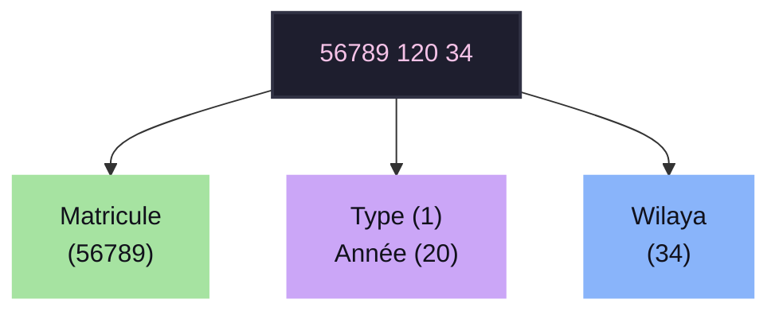

# Cahier des Charges Techniques Détaillé
## ParkNet — Système Intelligent de Gestion de Parking & Contrôle d'Accès IoT
**Spécifique au Format Algérien**

> **Auteur :** Département Informatique / Projet ParkNet  
> **Date :** Mai 2026  
> **Statut :** Officiel

---

## Table des Matières
1. [Introduction et Contexte](#1-introduction-et-contexte)
2. [Pile Technologique Exigée (Tools Used)](#2-pile-technologique-exigée-tools-used)
3. [Structure de la Base de Données (Database Schema)](#3-structure-de-la-base-de-données-database-schema)
4. [Logique d'Extraction (OCR Catch and Clean) et Décodage (Wilaya & Type)](#4-logique-dextraction-ocr-catch-and-clean-et-décodage-wilaya--type)
   - [4.1 Algorithme de Filtrage (Python)](#41-algorithme-de-filtrage-python)
   - [4.2 Décodage des Métadonnées Algériennes (JavaScript)](#42-décodage-des-métadonnées-algériennes-javascript)
5. [Diagramme Synthétique du Découpage de Plaque (LAPI)](#5-diagramme-synthétique-du-découpage-de-plaque-lapi)
6. [Interface Utilisateur & Annexes (Screenshots)](#6-interface-utilisateur--annexes-screenshots)
7. [Conclusion](#7-conclusion)

---

## 1. Introduction et Contexte
Afin d'optimiser le contrôle d'accès et la sécurité, ce document stipule les spécifications exhaustives pour la création de la plateforme **ParkNet**, basée sur la Lecture Automatique de Plaques d'Immatriculation (LAPI). Le défi majeur réside dans le bruitage des images en temps réel et la nécessité absolue de décoder les blocs spécifiques de l'immatriculation algérienne.

---

## 2. Pile Technologique Exigée (Tools Used)
L'architecture logicielle doit être découplée et hautement réactive :

*   **Serveur Backend :** Python 3.x couplé au micro-framework **Flask**.
*   **Moteur OCR (Optical Character Recognition) :** L'utilisation de l'API Cloud **Free OCR API (ocr.space)**, spécifiquement le moteur d'apprentissage profond 2 (*OCREngine=2*).
*   **Temps Réel :** **Socket.IO** via le module `Flask-SocketIO` pour la diffusion sans requête (push) des nouvelles captures vers le front-end.
*   **Base de Données :** **SQLite3** pour la persistance légère et sans configuration des journaux.
*   **Client Frontend :** HTML5, CSS3 intégrant l'esthétique **Glassmorphism** (effets de verre dépoli et de flou) et **Vanilla JavaScript** natif sans frameworks lourds pour un traitement DOM immédiat.

---

## 3. Structure de la Base de Données (Database Schema)
Le système enregistrera toutes les requêtes OCR réussies. Un schéma statique est défini ainsi :

| Champ | Type (SQLite) | Rôle |
| :--- | :--- | :--- |
| `id_capture` | INTEGER | Clé primaire, auto-incrémentée. |
| `plaque_immatriculation` | TEXT | Numéro final après nettoyage par Regex. |
| `date_heure_capture` | TEXT | Horodatage (`YYYY-MM-DD HH:MM:SS`). |
| `chemin_image` | TEXT | Emplacement système de l'image téléchargée. |
| `fiabilite_lecture` | REAL | Pourcentage de détection rapporté par l'API. |
| `id_camera` | INTEGER | ID source (ex: 1 = Smartphone X). |

---

## 4. Logique d'Extraction (OCR Catch and Clean) et Décodage (Wilaya & Type)
Le système ne doit jamais insérer les résultats OCR bruts dans la base de données en raison du taux de salissure des plaques physiques.

### 4.1 Algorithme de Filtrage (Python)
1.  **Réception :** Récupération de la chaîne brute depuis l'API.
2.  **Catch & Clean :** Application de l'expression régulière `r'[^\d\s\-]'` pour supprimer définitivement toute lettre (à l'exception des espaces et tirets).
3.  **Validation stricte :** Vérification via le Regex `(\d{4,6})[\s\-]+(\d{3})[\s\-]+(\d{2})`.
4.  **Reconstruction Heuristique :** En cas d'échec du Regex, un extracteur extrême isole uniquement les chiffres. Si la taille dépasse 9 caractères, le code Wilaya est identifié rétrospectivement par les 2 derniers chiffres.

### 4.2 Décodage des Métadonnées Algériennes (JavaScript)
Côté client, la fonction `parseAlgerianPlate()` reçoit une chaîne validée de type `MATRICULE TYPE_ANNEE WILAYA`.

*   **Identification de la Wilaya :** Le dernier segment subit une évaluation numérique. Les valeurs $\le 58$ utilisent un mapping strict en JavaScript (ex. $31 \rightarrow$ Oran, $16 \rightarrow$ Alger). Les valeurs supérieures à 58 et $\le 69$ sont classées comme *"Nouvelles Wilayas"*.
*   **Catégorie du Véhicule :** Le premier chiffre du segment central est isolé (`charAt(0)`). 1 = Tourisme, 2 = Camion, 9 = Moto.
*   **Déduction de l'Année :** Les deux caractères suivants forment l'année. Si le chiffre est $> 50$, le millénaire ratiociné est le 20ème (ex: $99 \rightarrow 1999$). S'il est $\le 50$, il appartient au 21ème siècle ($22 \rightarrow 2022$).

---

## 5. Diagramme Synthétique du Découpage de Plaque (LAPI)
Le schéma ci-dessous décrit le découpage logique d'une plaque interceptée `"56789 120 34"`.

*Figure 1 : Structure Standard Algérienne Extraite par le Système*

---

## 6. Interface Utilisateur & Annexes (Screenshots)
L'interface finale **doit inclure** :
1.  Un tableau de détail extrayant graphiquement les 3 blocs vus à la Figure 1.
2.  Une capacité de **Groupement Dynamique** natif (via un `<select>`) réorganisant les divs HTML en temps réel lors de la réception d'un événement par Socket.IO sans requêter la base SQLite cible.

*Les Figures illustrant le rendu exact du Tableau de Bord (Dashboard) (`capture_details.png`) et du mécanisme de regroupement (`grouping_dropdown.png`) devront être ajoutées en rapport de production finale.*

---

## 7. Conclusion
Ce système garantit de ne transférer que de la donnée pure, structurée et propre dans le SGBD, réduisant drastiquement les erreurs logiques de la base d'immatriculations.
