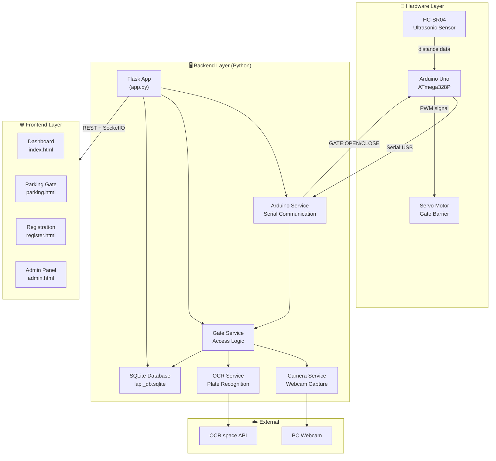
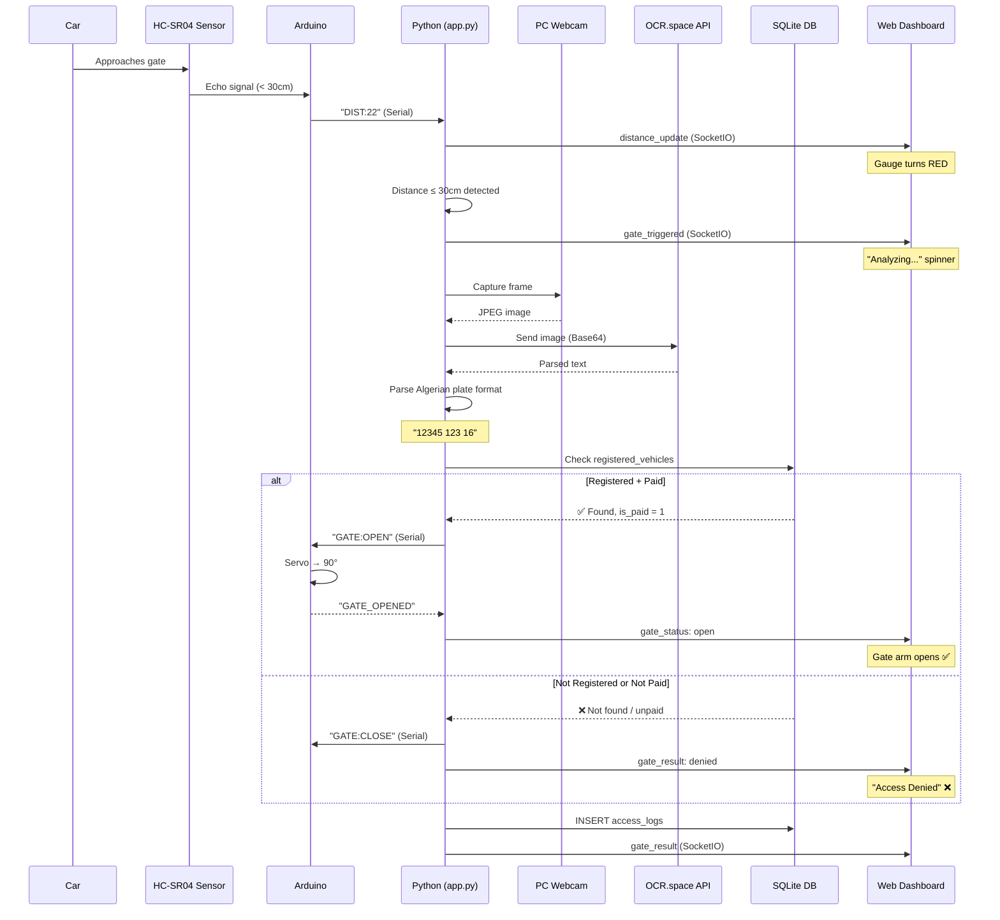
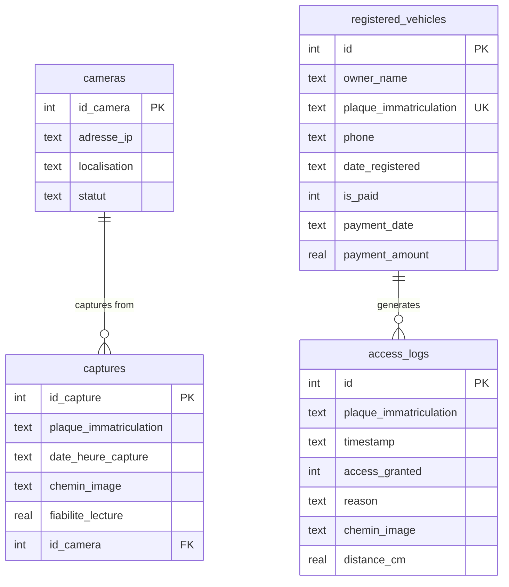
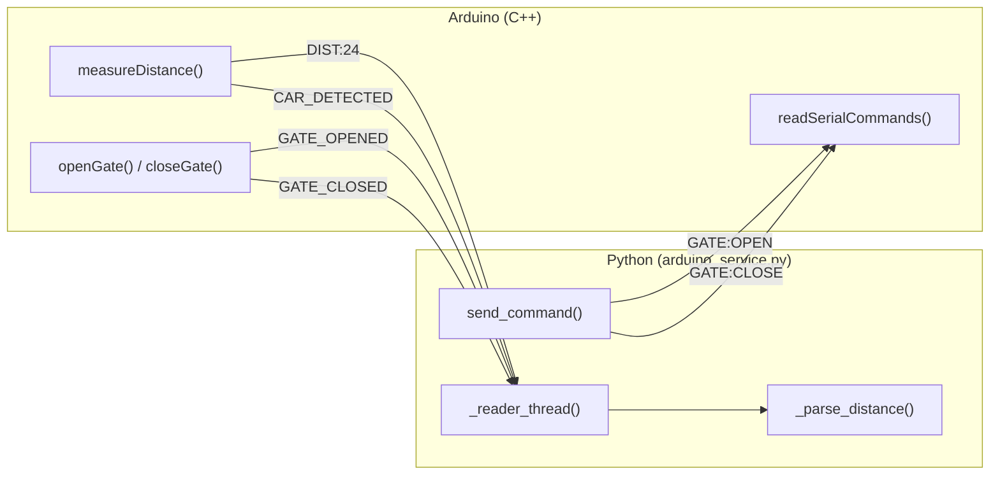
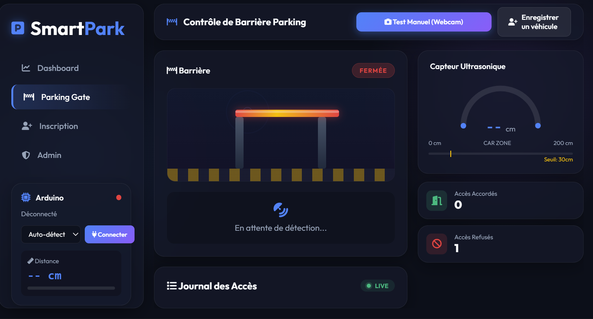
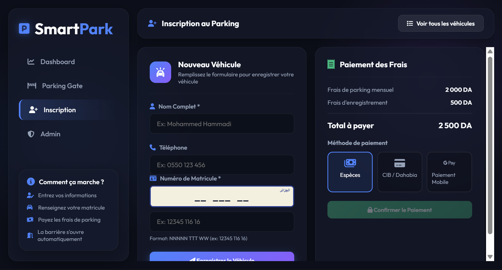

# Smart Parking System — Project Report

## 1. Project Overview

### 1.1 Context
This project was developed as part of the **ISI (Institut Supérieur d'Informatique)** curriculum. It implements an **intelligent parking access control system** that combines embedded hardware (Arduino) with a web-based administration platform.

### 1.2 Objective
Build a fully integrated system that:
- **Detects** approaching vehicles using an ultrasonic sensor
- **Captures** license plate images via a PC webcam
- **Reads** the plate number using OCR (Optical Character Recognition)
- **Verifies** registration and payment status in a database
- **Controls** a physical gate barrier (servo motor) based on verification results
- **Provides** a real-time web dashboard for monitoring and administration

### 1.3 Key Features
| Feature | Description |
|---------|-------------|
| Automatic Detection | HC-SR04 ultrasonic sensor detects cars < 30 cm |
| License Plate OCR | OCR.space API with Algerian plate format parsing |
| Access Control | Gate opens only for registered + paid vehicles |
| Real-time Dashboard | Live distance gauge, gate animation, access logs |
| Vehicle Registration | Web form to register vehicles with owner info |
| Payment Management | Admin panel to mark vehicles as paid/unpaid |
| Arduino Integration | Serial communication for sensor data + gate control |

---

## 2. Technologies Used

### 2.1 Technology Stack

| Layer | Technology | Version | Purpose |
|-------|-----------|---------|---------|
| **Backend** | Python | 3.x | Server-side logic |
| **Web Framework** | Flask | 3.0.0 | HTTP routing & templates |
| **Real-time** | Flask-SocketIO | 5.3.6 | WebSocket communication |
| **Database** | SQLite | Built-in | Persistent data storage |
| **OCR** | OCR.space API | v2 | License plate text extraction |
| **Computer Vision** | OpenCV | 4.9.0 | Webcam capture |
| **Serial Comm.** | PySerial | 3.5 | Arduino ↔ Python communication |
| **Frontend** | HTML/CSS/JS | - | Web interface |
| **Embedded** | Arduino (C++) | AVR | Sensor reading + servo control |
| **Hardware** | HC-SR04 | - | Ultrasonic distance sensor |
| **Hardware** | Servo Motor (SG90) | - | Gate barrier actuator |

### 2.2 Architecture Pattern
- **Backend**: Modular Flask application with Blueprints (MVC-inspired)
- **Communication**: REST API + WebSocket (SocketIO) for real-time updates
- **Hardware**: Serial protocol over USB (9600 baud)

---

## 3. System Architecture

### 3.1 High-Level Architecture



### 3.2 Sequence Diagram — Car Detection Flow



---

## 4. Database Schema

### 4.1 Entity-Relationship Diagram



### 4.2 Table Descriptions

| Table | Purpose | Key Fields |
|-------|---------|------------|
| `cameras` | Camera/capture device registry | IP, location, status |
| `captures` | All OCR capture records | plate, timestamp, image path, reliability |
| `registered_vehicles` | Authorized vehicles | owner, plate (unique), payment status |
| `access_logs` | Gate access history | plate, granted/denied, reason, distance |

---

## 5. Arduino–Python Serial Protocol

### 5.1 Communication Diagram



### 5.2 Message Reference

| Direction | Message | Meaning |
|-----------|---------|---------|
| Arduino → PC | `DIST:<cm>` | Current ultrasonic distance (every 300ms) |
| Arduino → PC | `CAR_DETECTED` | Vehicle within detection range (< 30cm) |
| Arduino → PC | `GATE_OPENED` | Servo moved to 90° (gate open) |
| Arduino → PC | `GATE_CLOSED` | Servo moved to 0° (gate closed) |
| Arduino → PC | `PARKING_SYSTEM_READY` | Arduino booted and ready |
| PC → Arduino | `GATE:OPEN` | Command to open gate (after DB verification) |
| PC → Arduino | `GATE:CLOSE` | Command to close gate |

### 5.3 Settings
- **Baud rate**: 9600
- **Line terminator**: `\n` (newline)
- **USB interface**: Virtual COM port (e.g., COM3)

---

## 6. Hardware Wiring

### 6.1 Pin Connections

| Component | Pin | Arduino Pin | Notes |
|-----------|-----|-------------|-------|
| HC-SR04 VCC | VCC | 5V | Power |
| HC-SR04 GND | GND | GND | Ground |
| HC-SR04 TRIG | Trigger | Pin 9 | Output — sends pulse |
| HC-SR04 ECHO | Echo | Pin 10 | Input — receives echo |
| Servo Signal | Orange/Yellow | Pin 6 | PWM control |
| Servo VCC | Red | 5V | Power |
| Servo GND | Brown/Black | GND | Ground |

### 6.2 Wiring Diagram

```
Arduino Uno
┌─────────────────────┐
│                     │
│  Pin 9  ──────────── TRIG ─┐
│  Pin 10 ──────────── ECHO ─┤  HC-SR04
│  5V     ──────────── VCC  ─┤  Ultrasonic
│  GND    ──────────── GND  ─┘  Sensor
│                     │
│  Pin 6  ──────────── Signal ─┐
│  5V     ──────────── VCC    ─┤  Servo Motor
│  GND    ──────────── GND    ─┘  (Gate)
│                     │
│  USB ═══════════════ PC (COM3, 9600 baud)
└─────────────────────┘
```

---

## 7. REST API Reference

### 7.1 Page Routes

| Method | Endpoint | Description |
|--------|----------|-------------|
| GET | `/` | Main dashboard |
| GET | `/parking` | Parking gate control page |
| GET | `/register` | Vehicle registration form |
| GET | `/admin` | Admin panel |

### 7.2 Capture API

| Method | Endpoint | Description |
|--------|----------|-------------|
| POST | `/upload` | Upload image for OCR |
| GET | `/api/captures` | Get last 50 captures |
| DELETE | `/api/captures/<id>` | Delete a capture |

### 7.3 Vehicle API

| Method | Endpoint | Description |
|--------|----------|-------------|
| POST | `/api/register` | Register a new vehicle |
| GET | `/api/vehicles` | List all registered vehicles |
| POST | `/api/vehicles/<id>/pay` | Mark vehicle as paid |
| POST | `/api/vehicles/<id>/unpay` | Mark vehicle as unpaid |
| DELETE | `/api/vehicles/<id>` | Delete a vehicle |

### 7.4 Parking / Gate API

| Method | Endpoint | Description |
|--------|----------|-------------|
| POST | `/api/gate/capture` | Manual capture + OCR + gate control |
| POST | `/api/check-plate` | Check plate status without gate action |
| GET | `/api/access-logs` | Get access history (last 100) |

### 7.5 Arduino API

| Method | Endpoint | Description |
|--------|----------|-------------|
| GET | `/api/arduino/status` | Connection status + last distance |
| POST | `/api/arduino/connect` | Connect to serial port |
| POST | `/api/arduino/disconnect` | Disconnect |
| GET | `/api/arduino/ports` | List available COM ports |
| POST | `/api/arduino/command` | Send raw command to Arduino |

### 7.6 SocketIO Events

| Event | Direction | Payload |
|-------|-----------|---------|
| `distance_update` | Server → Client | `{distance: float}` |
| `gate_triggered` | Server → Client | `{message: string}` |
| `gate_status` | Server → Client | `{status: "open"/"closed"}` |
| `gate_result` | Server → Client | `{access, plate, reason, ...}` |
| `new_capture` | Server → Client | `{plaque, fiabilite, timestamp, image}` |
| `arduino_status` | Server → Client | `{connected, port, message}` |
| `vehicle_registered` | Server → Client | `{id, owner, plate, ...}` |
| `vehicle_updated` | Server → Client | `{id, is_paid}` |
| `vehicle_deleted` | Server → Client | `{id}` |

---

## 8. Project Structure

```
lapi_app/
│
├── app.py                          # Entry point — Flask init, blueprints, startup
├── config.py                       # Constants and settings
├── database.py                     # SQLite connection + schema initialization
├── init_db.py                      # Backward-compatible DB init script
├── requirements.txt                # Python dependencies
├── lapi_db.sqlite                  # SQLite database file
├── test_arduino.py                 # Standalone Arduino diagnostic tool
│
├── services/                       # Backend business logic
│   ├── __init__.py
│   ├── arduino_service.py          # Serial communication with Arduino
│   ├── ocr_service.py              # OCR API + plate format parsing
│   ├── camera_service.py           # Webcam capture via OpenCV
│   └── gate_service.py             # Detection pipeline orchestrator
│
├── routes/                         # Flask route blueprints
│   ├── __init__.py
│   ├── pages.py                    # HTML page routes
│   ├── capture_routes.py           # Image upload + capture API
│   ├── vehicle_routes.py           # Vehicle registration + payment API
│   ├── parking_routes.py           # Gate control + access logs API
│   └── arduino_routes.py           # Arduino serial control API
│
├── templates/                      # Jinja2 HTML templates
│   ├── index.html                  # Main dashboard
│   ├── parking.html                # Parking gate control
│   ├── register.html               # Vehicle registration form
│   └── admin.html                  # Administration panel
│
├── static/                         # Frontend static assets
│   ├── css/
│   │   ├── style.css               # Global styles
│   │   └── parking.css             # Parking page styles
│   ├── js/
│   │   ├── script.js               # Dashboard logic
│   │   ├── parking.js              # Gate control + SocketIO events
│   │   ├── register.js             # Registration form logic
│   │   └── admin.js                # Admin panel logic
│   └── uploads/                    # Captured images
│
├── arduino/                        # Arduino sketches
│   ├── arduino_parking/
│   │   └── arduino_parking.ino     # Main parking system sketch
│   └── test_sensor_servo.ino       # Standalone hardware test
│
└── docs/                           # Documentation
    └── rapport.md                  # This report
```

---

## 9. How to Run

### 9.1 Prerequisites
- Python 3.8+
- Arduino Uno with HC-SR04 + Servo wired (see Section 6)
- PC webcam
- Arduino IDE (for uploading sketch)

### 9.2 Installation

```bash
# Install Python dependencies
pip install -r requirements.txt

# Upload Arduino sketch
# Open arduino/arduino_parking/arduino_parking.ino in Arduino IDE
# Select Board: Arduino Uno, Port: COM3, then Upload
```

### 9.3 Running

```bash
# Start the application
py app.py
```

Then open in browser:
- **Dashboard**: http://localhost:5000/
- **Parking Gate**: http://localhost:5000/parking
- **Registration**: http://localhost:5000/register
- **Admin Panel**: http://localhost:5000/admin

### 9.4 Testing Arduino Standalone

```bash
# Close app.py first, then run:
py test_arduino.py
```

---

## 10. User Interfaces

The Smart Parking System features a modern, responsive web dashboard for both users and administrators.

### 10.1 Main Dashboard
Displays real-time system metrics, active cameras, and recent captures.


### 10.2 Parking Gate Control
Live distance monitoring, gate status animation, and access logs.


### 10.3 Vehicle Registration
Form to register new vehicles and process payments.


### 10.4 Administration Panel
Manage registered vehicles, view payment status, and review access history.


---

## 11. Conclusion

This project demonstrates a complete **IoT-integrated web application** that bridges embedded hardware (Arduino sensors and actuators) with a modern web stack (Flask, SocketIO, REST API). The modular architecture ensures clean separation of concerns:

- **Services layer** handles all business logic independently
- **Routes layer** exposes clean REST API endpoints
- **Arduino communication** is fully abstracted behind `arduino_service.py`
- **Real-time updates** via WebSocket keep the dashboard responsive

The system successfully automates parking gate access control with license plate recognition, providing a practical foundation that can be extended with features like multiple camera support, license plate image preprocessing, or integration with payment gateways.
